## Démonstration
- Consul service

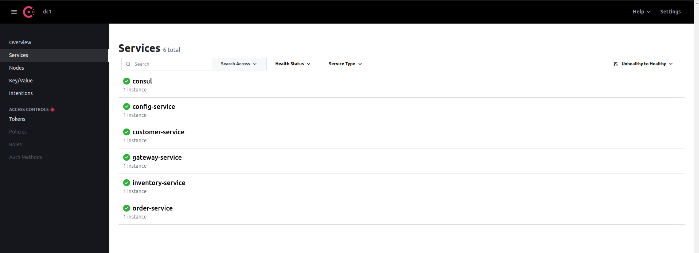

- customer service

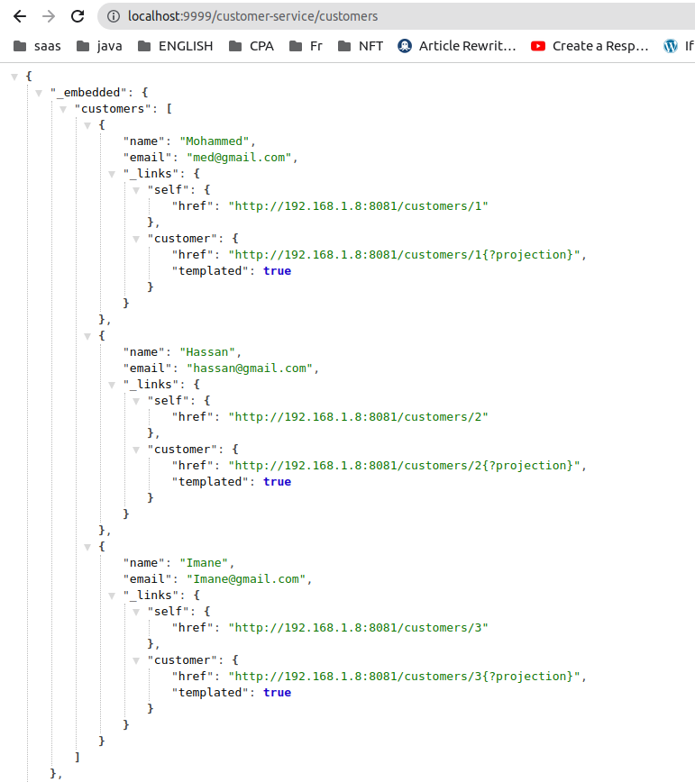

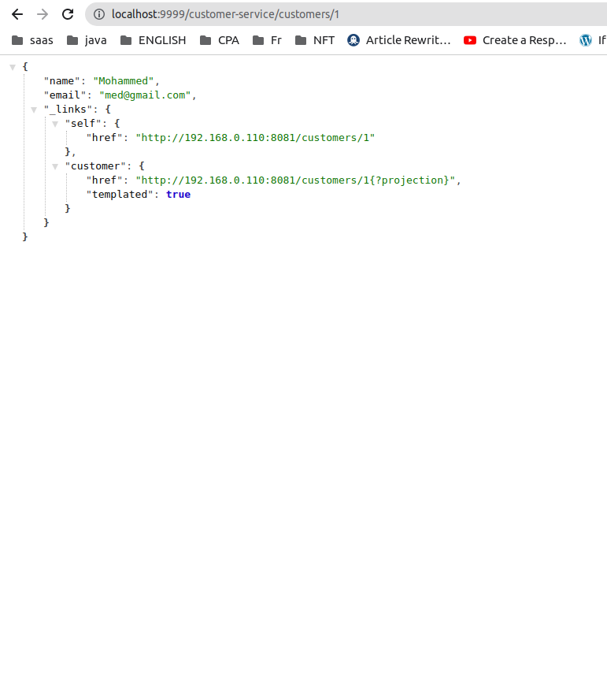

- Inventory service

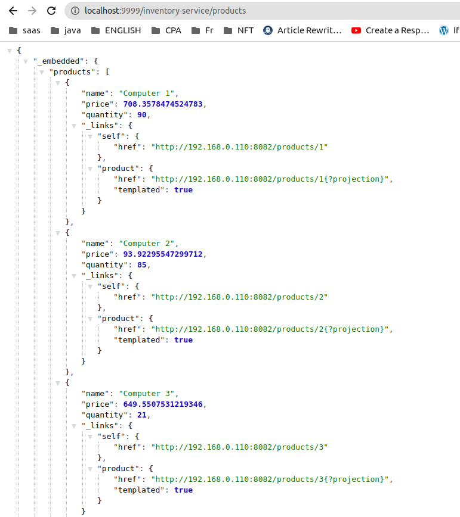

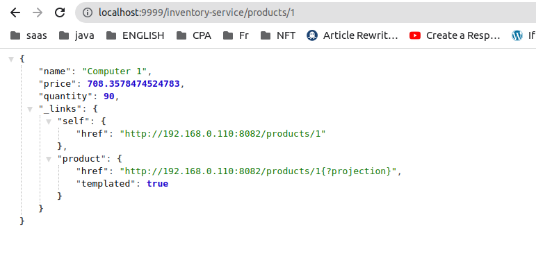

- Order service

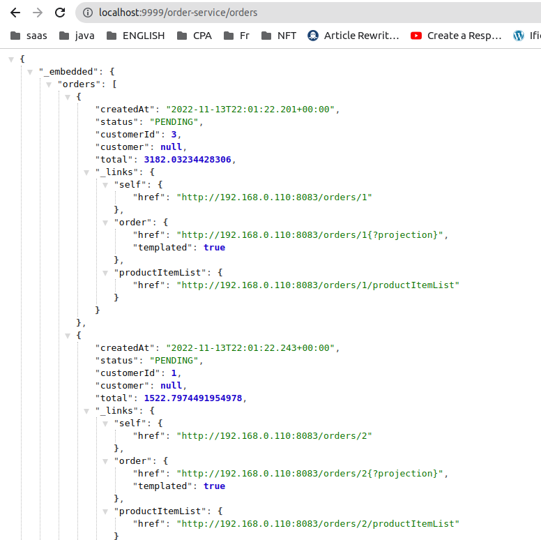

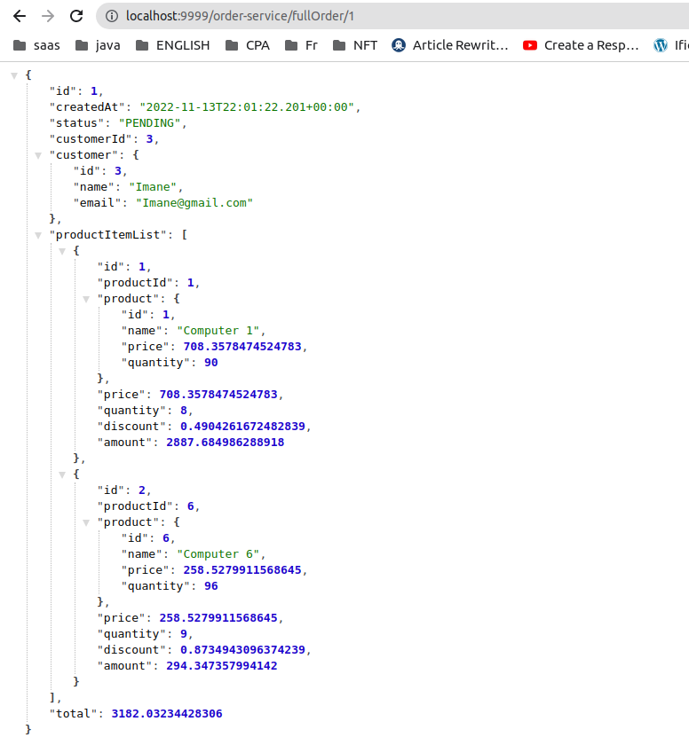

- configuration  service
```properties
server.port=8888
spring.application.name=config-service
spring.cloud.config.server.git.default-label=master
spring.cloud.config.server.git.uri=file:/home/hassan/Documents/Projets/spring/ecom/ecom/ecom/config.repo

```
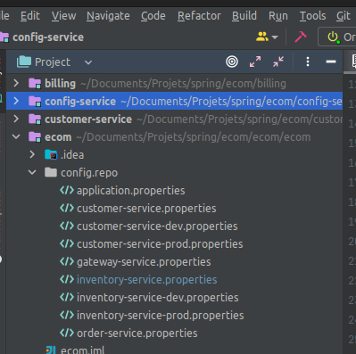

## Front end
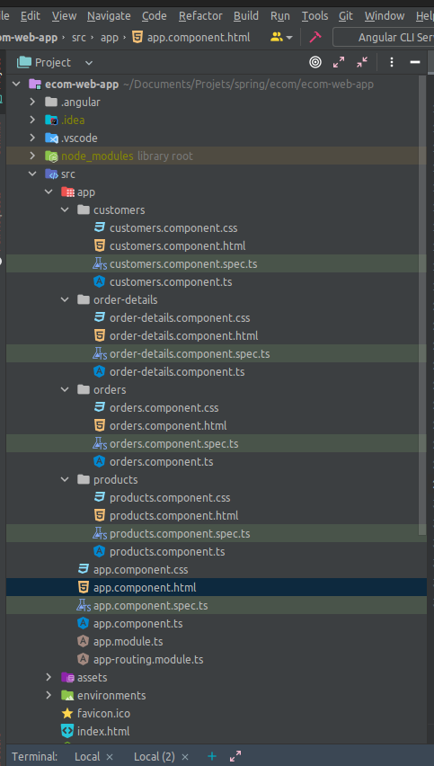
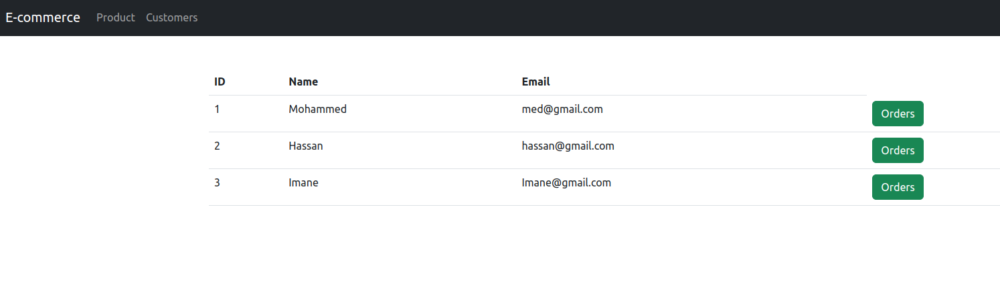
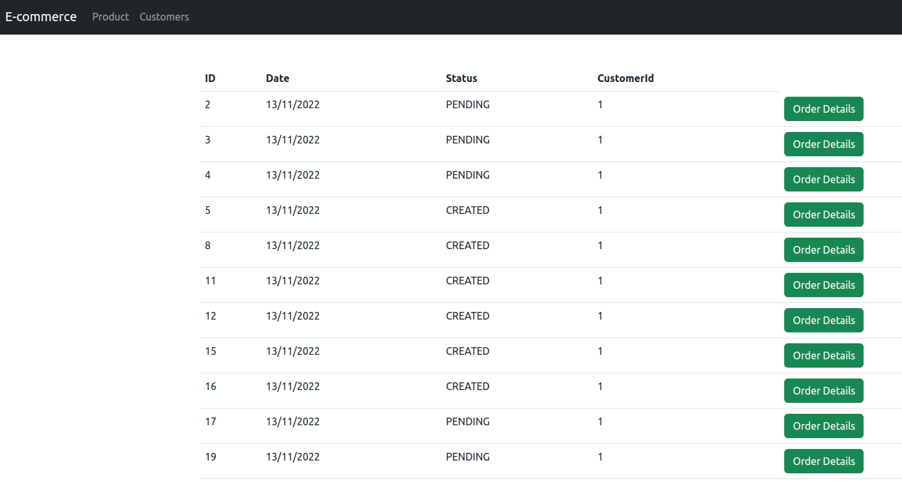
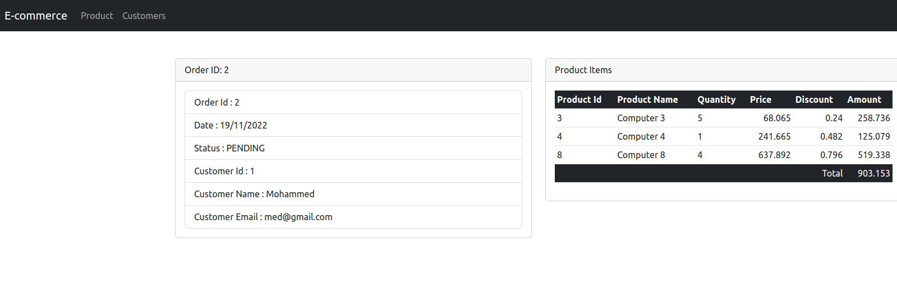
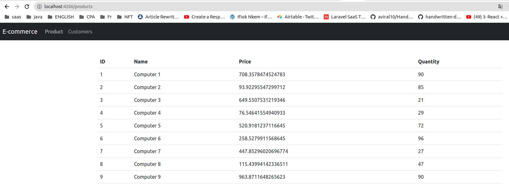
